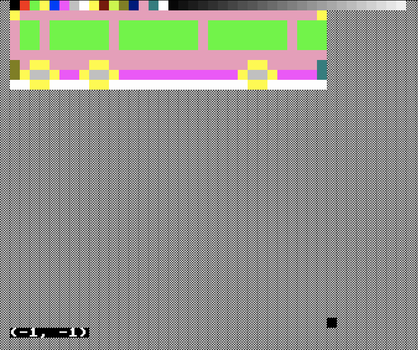

# Sprite Editor

`Sprite Editor` is a [`NCurses Game Engine`](../README.md) `cb::Sprite` editor/viewer.



## Usage

`Sprite Editor` is compiled with:

```shell
cmake .
make
```

This results in a binary executable called `SpriteEditor`, which is invoked as:

```shell
./SpriteEditor
```

Optionally, the first command line parameter can be used to load a `cb::Sprite` from file, for example:

```shell
./SpriteEditor mysprite.sprite
```

`Sprite Editor` uses the mouse to select colors and place pixels (left button). Furthermore, the table below lists the keys that are recognized and their associated action.

|key|action|
----|-----
|`s`|write `cb::Sprite` to `out.sprite`|
|`q`|quit|

## Notes

1. Set `TERM` to `xterm-256colors` in your terminal for the best results.
2. For a 'retro' feel and square pixels, install a `classic text mode font` from [The Ultimate Oldschool PC Font Pack](https://int10h.org/oldschool-pc-fonts/).
3. `Sprite Editor` allows dynamic resizing of the terminal window.

## BSD-3 License

Redistribution and use in source and binary forms, with or without modification, are permitted provided that the following conditions are met:

1. Redistributions of source code must retain the above copyright notice, this list of conditions and the following disclaimer.

2. Redistributions in binary form must reproduce the above copyright notice, this list of conditions and the following disclaimer in the documentation and/or other materials provided with the distribution.

3. Neither the name of the copyright holder nor the names of its contributors may be used to endorse or promote products derived from this software without specific prior written permission.

THIS SOFTWARE IS PROVIDED BY THE COPYRIGHT HOLDERS AND CONTRIBUTORS "AS IS" AND ANY EXPRESS OR IMPLIED WARRANTIES, INCLUDING, BUT NOT LIMITED TO, THE IMPLIED WARRANTIES OF MERCHANTABILITY AND FITNESS FOR A PARTICULAR PURPOSE ARE DISCLAIMED. IN NO EVENT SHALL THE COPYRIGHT HOLDER OR CONTRIBUTORS BE LIABLE FOR ANY DIRECT, INDIRECT, INCIDENTAL, SPECIAL, EXEMPLARY, OR CONSEQUENTIAL DAMAGES (INCLUDING, BUT NOT LIMITED TO, PROCUREMENT OF SUBSTITUTE GOODS OR SERVICES; LOSS OF USE, DATA, OR PROFITS; OR BUSINESS INTERRUPTION) HOWEVER CAUSED AND ON ANY THEORY OF LIABILITY, WHETHER IN CONTRACT, STRICT LIABILITY, OR TORT (INCLUDING NEGLIGENCE OR OTHERWISE) ARISING IN ANY WAY OUT OF THE USE OF THIS SOFTWARE, EVEN IF ADVISED OF THE POSSIBILITY OF SUCH DAMAGE.
